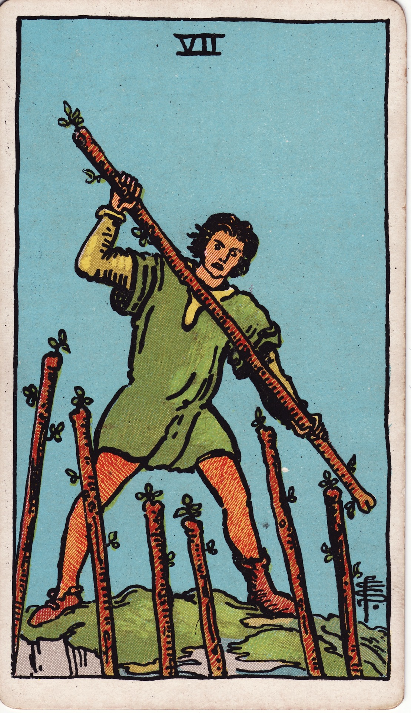

# Seven of Wands

The Seven of Wands is the stand on the high ground—the moment you defend your torch against challengers. It reflects courage under pressure, fierce conviction, and the willingness to hold your position even when outnumbered.

*Keywords:* defense, conviction, resilience, boundaries, perseverance
*Mood:* vigilant, fierce, unyielding, adrenalized
*Polarity:* directive, protective

*Art interpretation cue:* Depict a figure on elevated terrain wielding a wand against unseen challengers below. Emphasize exertion, resolve, and a vantage that indicates earned advantage.

### Artistic Direction

Show the tension of defending what has been claimed. The composition should highlight determination, grit, and the sacred effort required to sustain success.

*   **Core Symbolism & Composition:**
    *   **The Elevated Defender:** The protagonist stands above, suggesting strategic positioning and moral high ground.
    *   **Six Opposing Wands:** Wands emerging from below imply multiple challengers testing the defender’s resolve.
    *   **Dynamic Stance:** Leaning forward, gripping tightly, or bracing against pressure communicates the physicality of holding the line.
    *   **Stormy Skies or Dust Clouds:** Environmental turbulence mirrors the internal adrenaline and urgency.
*   **Mood & Atmosphere:**
    Use molten ambers, deep forest greens, and storm-slate grays. Allow dramatic lighting to underscore intensity and focus.

### Esoteric Correspondences

*   **Title:** The Lord of Valour.
*   **Astrology:** Mars in Leo (August 12 – August 22). Courage, pride, and heart-fueled defense of one’s territory.
*   **Element:** Fire under siege, yet burning brighter through resistance.
*   **Kabbalah:** Netzach in Atziluth (Victory in the World of Emanation). Perseverance of desire against opposing forces.

### Numerology (7)

Seven is the sacred challenger—the number of tests, initiation, and spiritual grit. In Wands, it demands active courage and boundary-setting to protect your vision.

### Core Meanings (Upright)

*   **Holding the Line:** Defending progress, protecting your reputation, or sustaining a cause.
*   **Courageous Boundaries:** Saying no with conviction; standing up to critics.
*   **Breakthrough Through Pressure:** Challenges strengthen resolve and clarify priorities.
*   **Heroic Resilience:** A warrior moment—push through, you are almost there.

### Core Meanings (Reversed)

*   **Overwhelm:** Exhaustion, burnout, or feeling outmatched.
*   **Defensiveness:** Fighting phantom threats or reacting from insecurity.
*   **Collapse of Boundaries:** Giving up ground due to fatigue or conflict avoidance.
*   **Need for Strategy:** Raw effort without planning draining your fire.

### The Card as a Person

*   **Upright:** A defender, whistleblower, activist, or leader protecting the integrity of their mission.
*   **Reversed:** Someone easily triggered, in constant fight mode, or struggling to advocate for themselves.

### Guiding Questions

*   **Upright:**
    *   What is worth defending even when it costs me comfort?
    *   Which boundaries require reinforcement?
    *   How can I rely on past victories to fuel today’s courage?
    *   Where can strategy support strength so I’m not fighting alone?
*   **Reversed:**
    *   What support do I need to recharge and keep standing?
    *   Am I defending something that no longer aligns with my truth?
    *   How can I pause to reassess before reacting?
    *   Where might collaboration replace constant struggle?

### Affirmations

*   **Upright:** “I hold my ground with valor; my fire is worth protecting.”
*   **Reversed:** “I choose my battles wisely and fortify myself with support.”

### Love & Relationships

*   **Upright:** Protecting the relationship from external pressures, defending shared values, advocating for each other.
*   **Reversed:** Hyper-defensiveness, misinterpreting feedback as attack, or partners fighting alone.
*   **Self-Question:** “What alliance or boundary will keep our bond strong amid challenge?”

### Work & Money

*   **Upright:** Standing firm against competition, defending intellectual property, negotiating from a place of strength.
*   **Reversed:** Overwork, feeling besieged by demands, or lacking allies in struggles.
*   **Self-Question:** “What reinforcement—team, strategy, resources—will help me sustain this position?”

### Spiritual & Psychological

*   **Themes:** Heroic courage, stamina, warrior spirit, discerning righteous battles.
*   **Actionable Advice:**
    1.  **Shield Visualization:** Imagine a protective, fiery barrier around your mission; reinforce it with affirmations of worth.
    2.  **Battle Debrief:** Reflect on recent conflicts—what did they reveal about your values and limits?
    3.  **Support Squad:** List allies who can stand with you; ask for backup where needed.

### Cross-Card Echoes

*   **Seven of Wands ↔ Seven of Swords:** Courage versus cunning—decide whether to confront directly or strategize.
*   **Seven of Wands → Nine of Wands:** Continuing strength builds seasoned resilience.
*   **Seven of Wands ↔ Strength:** Both harness inner fortitude and heart-centered courage.

### Impression Palette

#### Battle Mantra

“Feet planted, torch lifted—I am the gatekeeper of my own flame.”

#### Dramatic Monologue

They said the summit wind would strip me bare,  
yet here I stand—  
lungs aflame, eyes steady,  
defending the spark I chased this far.
