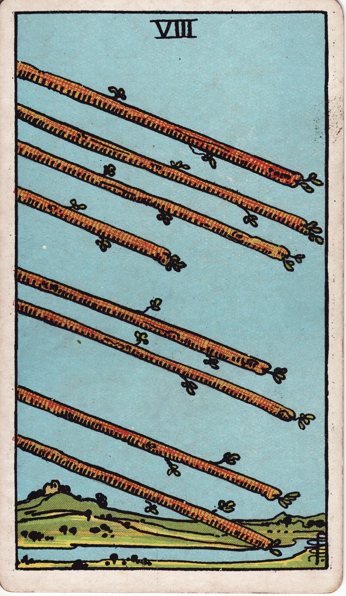

# Eight of Wands

The Eight of Wands is the rush of acceleration—the arrows of intention streaking toward their destination. It represents swift movement, rapid communication, and the exhilarating feeling of momentum once obstacles are removed.

*Keywords:* swift progress, rapid communication, momentum, decisive action
*Mood:* exhilarating, kinetic, focused, optimistic
*Polarity:* dynamic, forward-thrusting

*Art interpretation cue:* Illustrate wands flying through the air like arrows or comets. The landscape below can blur with motion, emphasizing speed and alignment.

### Artistic Direction

Convey pure motion. The entire composition should feel like a snapshot taken mid-flight—no hesitation, only velocity.

*   **Core Symbolism & Composition:**
    *   **Eight Aerial Wands:** Arrange them in parallel or converging trajectories, symbolizing focused intention headed toward a shared goal.
    *   **Clear Skies:** The absence of storm clouds or barriers communicates that the path is unobstructed.
    *   **Blurred Landscape:** Rivers, fields, or settlements below appear streaked, reinforcing rapid movement.
    *   **Light Trails:** Fiery tails or sparks highlight the energized momentum.
*   **Mood & Atmosphere:**
    Use cerulean skies, blazing golds, and streaks of incandescent orange. Let light radiate from the wands themselves.

### Esoteric Correspondences

*   **Title:** The Lord of Swiftness.
*   **Astrology:** Mercury in Sagittarius (November 23 – December 2). Messages fly fast; truth seeks horizon; enthusiasm fuels communication.
*   **Element:** Fire unleashed—movement, travel, waves of energy.
*   **Kabbalah:** Hod in Atziluth (Splendor in the World of Emanation). Intelligence and communication align with fiery intent.

### Numerology (8)

Eight is the number of motion and mastery through repetition. In Wands, it represents synchronized energy—multiple forces cooperating to accelerate outcome.

### Core Meanings (Upright)

*   **Rapid Progress:** Projects advance quickly; news or responses arrive promptly.
*   **Clear Communication:** Messages land; ideas are understood; alignment happens seamlessly.
*   **Travel & Movement:** Journeys, launches, or relocations executed efficiently.
*   **Momentum Alignment:** When you act in flow, everything speeds up.

### Core Meanings (Reversed)

*   **Delays:** Travel issues, miscommunication, or stalled momentum.
*   **Scattered Effort:** Too many directions at once, leading to overwhelm.
*   **Premature Action:** Moving before details are ready; needing to slow down and aim.
*   **Missed Messages:** Important communication lost in the rush; clarity required.

### The Card as a Person

*   **Upright:** A messenger, event coordinator, project accelerator, or passionate communicator.
*   **Reversed:** Someone impulsive, easily distracted, or prone to promising more than can be delivered on time.

### Guiding Questions

*   **Upright:**
    *   What signals confirm it’s time to go full speed ahead?
    *   How can I keep communications precise as things escalate?
    *   Which channels or modes of travel are most direct?
    *   How will I maintain focus while velocity increases?
*   **Reversed:**
    *   What information or preparation am I missing?
    *   Where can I apply brakes to avoid burnout or mistakes?
    *   Which message needs clarification or repetition?
    *   How can I re-synchronize my efforts for coherent progress?

### Affirmations

*   **Upright:** “I ride the current of momentum; my aim is true and my timing aligned.”
*   **Reversed:** “I recalibrate my pace so every action strikes its mark.”

### Love & Relationships

*   **Upright:** Love moves quickly—travel plans, heartfelt messages, passionate exchanges, long-distance reunions.
*   **Reversed:** Mixed signals, texts gone unanswered, or feeling rushed without emotional grounding.
*   **Self-Question:** “How can we keep our connection honest and clear amid rapid change?”

### Work & Money

*   **Upright:** Fast-paced projects, successful launches, quick approvals, viral success.
*   **Reversed:** Project delays, communication breakdowns, logistics needing reorganization.
*   **Self-Question:** “Where should I direct this surge of momentum to maximize impact?”

### Spiritual & Psychological

*   **Themes:** Flow state, synchronicity, trusting intuition when messages arrive in rapid succession.
*   **Actionable Advice:**
    1.  **Message Marathon:** Clear your inboxes, return calls, and close loops to keep energy flowing.
    2.  **Compass Check:** Write down your top three priorities to ensure speed aligns with purpose.
    3.  **Movement Meditation:** Walk, run, or dance, focusing on breath to integrate speed with presence.

### Cross-Card Echoes

*   **Eight of Wands ↔ Eight of Cups:** Momentum outward versus inward; choose which calling deserves acceleration.
*   **Eight of Wands ↔ The Chariot:** Coordinated movement powered by intent; mastery over velocity.
*   **Eight of Wands → Wheel of Fortune:** Rapid shifts create turning points—stay adaptable.

### Impression Palette

#### Telegram

“Mission cleared. Arrows in flight. Expect impact sooner than dawn.”

#### Blitz Haibun

The engines ignited at sunrise; eight embers rose, slicing sky with purpose. Each carried a message, a promise, a charge of possibility.  
Haiku:  
Winged wands streak the blue—  
answers racing toward my heart,  
echoes catching fire.
