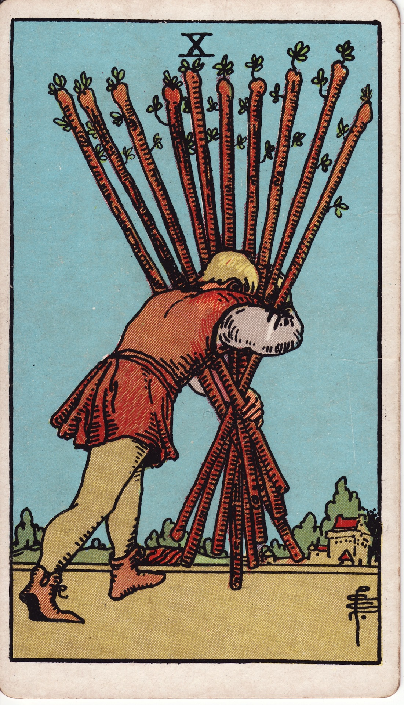

# Ten of Wands

The Ten of Wands is the weight of accomplishment—the moment when success becomes load-bearing, and responsibilities must be managed wisely. It reflects carrying too much alone, the burden of expectations, and the need to redistribute fire so it does not consume you.

*Keywords:* burden, responsibility, overwhelm, delegation, completion under strain
*Mood:* heavy, determined, overextended, dutiful
*Polarity:* stabilizing, contractive

*Art interpretation cue:* Portray a figure bent under the weight of ten bundled wands, trudging toward a settlement. The scene should highlight both achievement and exhaustion.

### Artistic Direction

Show the paradox of the card: victory achieved, yet carried at personal cost. Emphasize effort, strain, and the need for strategic release.

*   **Core Symbolism & Composition:**
    *   **The Bundled Wands:** Ten staves gathered in arms, obscuring the bearer’s view—symbolizing responsibilities overshadowing perspective.
    *   **The Destination:** A village or home in the distance indicates the goal is near but not yet reached.
    *   **Bent Posture:** The figure’s body shows the cost of carrying so much without help.
    *   **Dusty Path:** A dry, demanding road underlines fatigue and the need for conscious pacing.
*   **Mood & Atmosphere:**
    Use ochre, burnt sienna, and muted gold to convey late-afternoon weariness. Shadows lengthen to suggest the day ending and relief approaching.

### Esoteric Correspondences

*   **Title:** The Lord of Oppression.
*   **Astrology:** Saturn in Sagittarius (December 13 – December 21). Expansion meets responsibility; passion compressed by obligation.
*   **Element:** Fire encumbered—heat trapped under excess load.
*   **Kabbalah:** Malkuth in Atziluth (Kingdom in the World of Emanation). Fire reaches manifestation but risks burnout without wise stewardship.

### Numerology (10)

Ten marks completion and the threshold of a new cycle. In Wands, it signals carrying the full weight of what you’ve created; choices must be made about what continues forward.

### Core Meanings (Upright)

*   **Carrying Heavy Responsibilities:** Taking on many roles or commitments at once.
*   **Final Push:** Nearing the finish line; a concentrated effort is required.
*   **Overcommitment:** Success attracting more duties than originally intended.
*   **Need for Delegation:** Releasing tasks to sustain longevity.

### Core Meanings (Reversed)

*   **Burning Out:** Physical or emotional collapse from chronic overload.
*   **Refusing Help:** Believing you must do it all; martyrdom mindset.
*   **Dropping the Bundle:** Letting go of burdens that were never truly yours.
*   **Lightening the Load:** Reprioritizing to rekindle joy and efficiency.

### The Card as a Person

*   **Upright:** A high-achiever, caretaker, or leader carrying multiple obligations with grit.
*   **Reversed:** Someone overwhelmed, resentful, or at risk of losing passion under pressure.

### Guiding Questions

*   **Upright:**
    *   Which responsibilities are mission-critical, and which can be shared?
    *   How can I pace myself so I arrive with energy to enjoy the outcome?
    *   Where is it time to ask for help or build systems?
    *   What is the purpose that makes this weight worth carrying—for now?
*   **Reversed:**
    *   What can I put down today without betraying my values?
    *   Where have I confused martyrdom with dedication?
    *   How will I replenish myself once this load is delivered?
    *   Which boundaries must be reasserted to prevent future overload?

### Affirmations

*   **Upright:** “I organize my fire so that it fuels success without consuming me.”
*   **Reversed:** “I release burdens that are not mine and carry only what keeps my spirit alive.”

### Love & Relationships

*   **Upright:** One or both partners carrying heavy workloads; needing to share tasks to maintain closeness.
*   **Reversed:** Resentment from imbalance, emotional labor unacknowledged, or neglect due to burnout.
*   **Self-Question:** “How can we rebalance responsibilities so love remains a source of warmth, not strain?”

### Work & Money

*   **Upright:** Meeting deadlines, managing multiple projects, success bringing more duties.
*   **Reversed:** Workaholism, bottlenecks, or shedding commitments to regain efficiency.
*   **Self-Question:** “Which tasks can be delegated, automated, or postponed to protect the mission?”

### Spiritual & Psychological

*   **Themes:** Energy management, compassionate boundaries, transforming obligation into intentional service.
*   **Actionable Advice:**
    1.  **Burden Inventory:** List every responsibility; mark which energize, which drain, and which can be reassigned.
    2.  **Release Ritual:** Burn or bury a symbolic list of burdens you choose to relinquish.
    3.  **Support Circle:** Schedule conversations to redistribute workload or seek guidance.

### Cross-Card Echoes

*   **Ten of Wands ↔ Ten of Swords:** Physical overload versus mental overload; both ask for release and renewal.
*   **Ten of Wands → Ace of Wands:** Put down the bundle to pick up a single, inspired torch again.
*   **Ten of Wands ↔ Devil:** Examine where obligation becomes entrapment; reclaim agency.

### Impression Palette

#### Work Song

“One more mile, ten torches tight. When the door swings wide, I’ll lay them down and breathe.”

#### Prose Micro-Meditation

The village rooflines blur through the lattice of wands. Shoulders ache, yet every step hums: almost there. Soon the burden becomes a bonfire shared.
