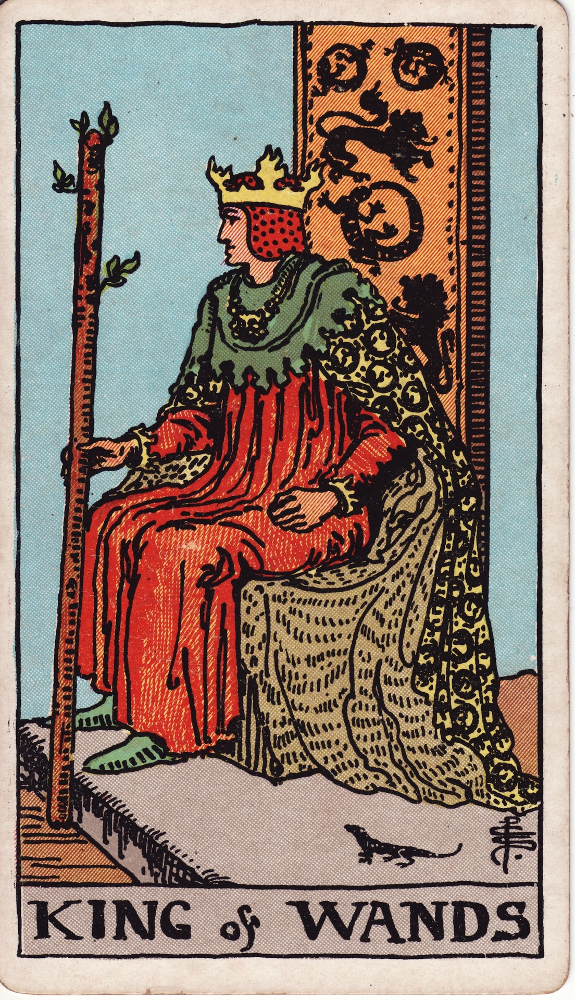

# King of Wands

The King of Wands is visionary fire—the sovereign strategist whose passion shapes enterprises, movements, and legacies. He commands with inspiration, steering bold endeavors while empowering others to shine alongside him.

*Keywords:* visionary leadership, entrepreneurship, authority, charisma, grand strategy
*Mood:* commanding, expansive, inspiring, decisive
*Polarity:* directive, generative

*Art interpretation cue:* Depict the King seated on a lion-adorned throne, a flowering wand in hand, gazing toward distant horizons. Salamanders or dragons encircle, symbolizing mastery over elemental fire.

### Artistic Direction

Present a sovereign radiating composed intensity. The scene should communicate mastery, foresight, and readiness to take decisive action.

*   **Core Symbolism & Composition:**
    *   **The Throne of Lions and Salamanders:** Combining courage and alchemical transformation, illustrating his dominion.
    *   **The Flaring Wand:** Blossoming or sparking, representing projects constantly in bloom under his guidance.
    *   **The Cloak & Crown:** Warm, solar colors with fiery motifs underscore command fueled by passion.
    *   **Expansive Landscape:** A kingdom, desert, or cityscape shows the scope of his influence.
*   **Mood & Atmosphere:**
    Use regal golds, ember reds, and deep indigos. Spotlight the King’s gaze and hands to show intentional action and steady resolve.

### Esoteric Correspondences

*   **Title:** The Prince of the Chariot of Fire.
*   **Astrology:** Fire of Fire—pure elemental authority, ruling 20° Scorpio to 20° Sagittarius.
*   **Element:** Fire of Fire. Inspired leadership, visionary command, the spark that ignites others.
*   **Kabbalah:** Chokmah to Tiphareth in Atziluth. Wisdom of fire pours into radiant, harmonized expression.

### Archetypal Role

Kings (or Princes) embody outward mastery and stewardship. In Wands, the King is the entrepreneur, coach, mentor, or ruler who directs passion toward impactful outcomes and models courageous leadership.

### Core Meanings (Upright)

*   **Visionary Command:** Seeing the big picture and mobilizing others to achieve it.
*   **Entrepreneurial Fire:** Launching ventures, scaling influence, leading by example.
*   **Empowered Presence:** A natural leader whose confidence inspires trust and loyalty.
*   **Strategic Momentum:** Aligning purpose with action to achieve long-range goals.

### Core Meanings (Reversed)

*   **Tyrannical Control:** Domineering behavior, ego-driven leadership, refusal to delegate.
*   **Burnout in Authority:** Exhaustion from carrying the torch alone; difficulty stepping back.
*   **Vision Without Execution:** Grand ideas lacking follow-through or support.
*   **Fear of Visibility:** Avoiding leadership despite innate capability.

### The Card as a Person

*   **Upright:** A CEO, creative director, coach, or mentor who commands respect and crafts inspired strategy.
*   **Reversed:** A bossy tyrant, impulsive risk-taker, or reluctant leader denying their influence.

### Guiding Questions

*   **Upright:**
    *   What vision am I ready to champion with full authority?
    *   How can I mentor others while expanding my own horizons?
    *   Which bold decision will set this mission ablaze?
    *   How do I balance ambition with integrity and care?
*   **Reversed:**
    *   Where do I need to relinquish control to empower my team?
    *   What rest or counsel will renew my leadership fire?
    *   How can I translate a big idea into actionable steps?
    *   Where am I hiding from the spotlight that is rightfully mine?

### Affirmations

*   **Upright:** “I lead with vision, courage, and unwavering creative purpose.”
*   **Reversed:** “I share the flame, delegate wisely, and let my leadership be replenished.”

### Love & Relationships

*   **Upright:** Dynamic partnerships driven by shared goals, mutual respect, and passionate intimacy.
*   **Reversed:** Overbearing control, prioritizing work over connection, or a partner feeling overshadowed.
*   **Self-Question:** “How can I ensure my leadership enhances our love instead of eclipsing it?”

### Work & Money

*   **Upright:** Entrepreneurship, visionary management, public recognition for bold initiatives.
*   **Reversed:** Micromanaging, burnout, taking on too much, or refusing to collaborate.
*   **Self-Question:** “Which alliances or delegations will magnify the impact of my leadership?”

### Spiritual & Psychological

*   **Themes:** Purpose mastery, leading from soul, integrating ambition with wisdom.
*   **Actionable Advice:**
    1.  **Vision Council:** Convene advisors or peers to refine and support your long-range plans.
    2.  **Legacy Journal:** Write about the legacy you aim to leave; identify current steps aligning with it.
    3.  **Leadership Sabbatical:** Schedule intentional rest or retreat to sustain clarity and fire.

### Cross-Card Echoes

*   **King of Wands ↔ King of Swords:** Passionate strategy meets rational governance—together, they enact effective leadership.
*   **King of Wands ↔ Emperor:** Both rule with authority; the King brings charisma, the Emperor structure.
*   **King of Wands → Ace of Wands:** Vision inspires new sparks—mentor others to ignite their own torches.

### Impression Palette

#### Manifesto Excerpt

“We will build cities of light, enterprises of courage, movements that remember the sun. Follow me; I have already seen the horizon.”

#### Crowned Haiku

Throne of ember gold—  
vision arcs across the flame,  
kingdoms rise in stride.
