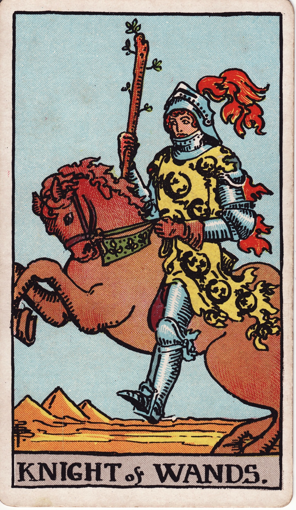

# Knight of Wands

The Knight of Wands is wildfire in motion—the charismatic crusader, the daring explorer, the embodiment of passion racing toward a target. He thrives on risk, thrives on the road, and burns to turn vision into adventure.

*Keywords:* bold pursuit, charisma, adventure, rapid change, passionate mission
*Mood:* impulsive, magnetic, high-octane, fearless
*Polarity:* dynamic, catalytic

*Art interpretation cue:* Show a knight or traveler charging forward on a rearing steed, brandishing a flaming wand or banner. The landscape should blur with heat and motion, hinting at deserts, volcanoes, or blazing sunsets.

### Artistic Direction

Portray unbridled momentum. The composition should pulse with courage, swagger, and the promise of a quest mid-flight.

*   **Core Symbolism & Composition:**
    *   **The Fiery Steed:** The horse snorts flames or is adorned with salamander motifs, emphasizing primal fire power.
    *   **The Knight’s Armor:** Decorated with feathers or sun emblems, signaling bravado and flair.
    *   **Raised Wand or Banner:** Represents the mission he champions—idea as flag.
    *   **Dramatic Sky:** Lightning, blazing sun, or swirling clouds accentuate epic scale.
*   **Mood & Atmosphere:**
    Use saturations of crimson, copper, and ultraviolet dusk. Motion lines, dust clouds, and flaring highlights communicate speed.

### Esoteric Correspondences

*   **Title:** The Lord of the Flame and the Lightning, the King of the Spirits of Fire.
*   **Astrology:** Air of Fire—strategic intensity and fiery intellect, ruling 20° Cancer to 20° Leo.
*   **Element:** Air of Fire. Passion transported by the winds of idea and ambition.
*   **Kabbalah:** Tiphareth in Atziluth (Beauty in the World of Emanation). Radiant fire carries the will outward in charismatic expression.

### Archetypal Role

Knights (or Princes) represent pursuit, mission, and kinetic expression. In Wands, the Knight is the adventurer charging ahead, embodying courage, magnetism, and trailblazing drive.

### Core Meanings (Upright)

*   **Bold Action:** A daring leap into new territory, fueled by confidence.
*   **Adventurous Opportunity:** Travel, relocation, or a high-energy project beckons.
*   **Charismatic Leadership:** Inspiring others through passion and presence.
*   **Rapid Transformation:** Life accelerates; embrace the ride.

### Core Meanings (Reversed)

*   **Impulsiveness:** Acting without plan, burning bridges, or quitting midway.
*   **Restless Energy:** Boredom leading to chaos or scattered focus.
*   **Overheated Ego:** Arrogance, showboating, or dominating the stage.
*   **Delayed Journey:** Mechanical, travel, or logistical issues slowing movement.

### The Card as a Person

*   **Upright:** A dynamic entrepreneur, performer, activist, or explorer who rallies others with infectious zeal.
*   **Reversed:** A hothead, unreliable drifter, or someone addicted to adrenaline without commitment.

### Guiding Questions

*   **Upright:**
    *   Where am I being invited to take a bold, spirited leap?
    *   How can I harness my charisma to inspire collaboration?
    *   What adventure is worth rearranging everything for?
    *   How do I stay present while racing toward my objective?
*   **Reversed:**
    *   What plan or structure will keep this fire from burning out?
    *   Where do I need patience before sprinting ahead?
    *   How can I channel restlessness into productive outlets?
    *   Who can serve as a grounded ally while I chase this mission?

### Affirmations

*   **Upright:** “I pursue my passion with courage, charisma, and purposeful fire.”
*   **Reversed:** “I direct my blaze wisely, pacing my steps to honor the journey.”

### Love & Relationships

*   **Upright:** Swept-off-your-feet romance, thrilling adventures, shared spontaneity.
*   **Reversed:** Commitment fear, ghosting, or whirlwind connections that fizzle fast.
*   **Self-Question:** “How can passion and presence co-exist so this fire sustains?”

### Work & Money

*   **Upright:** Launching ventures, taking a leadership role, pitching with charisma, seizing entrepreneurial chances.
*   **Reversed:** Job hopping, risky investments, or overpromising without infrastructure.
*   **Self-Question:** “What support systems ensure my big move delivers lasting impact?”

### Spiritual & Psychological

*   **Themes:** Hero’s journey, embodying personal myth, embracing courageous authenticity.
*   **Actionable Advice:**
    1.  **Quest Declaration:** Write a bold mission statement; read it aloud daily as a rallying cry.
    2.  **Fire Run:** Engage in vigorous movement—run, dance, or martial arts—to channel excess energy constructively.
    3.  **Adventure Planning:** Map practical steps for upcoming travel or projects so passion meets preparation.

### Cross-Card Echoes

*   **Knight of Wands ↔ Knight of Swords:** Fire meets air—passion and intellect combined can be unstoppable, but watch impulsiveness.
*   **Knight of Wands → Queen of Wands:** Raw dynamism matures into sovereign charisma.
*   **Knight of Wands ↔ The Chariot:** Harnessing speed with discipline to achieve victory.

### Impression Palette

#### Road Song

“Boots on flame, horizon hungry—I chase the sun until it learns my name.”

#### Epic Couplet

Banner blazing high,  
Trail of sparks in my wake—  
Charge, heart, never shy.
