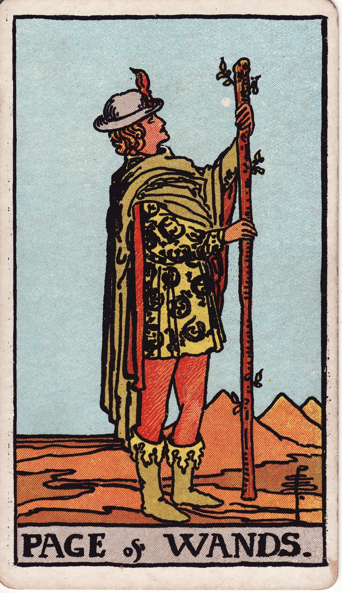

# Page of Wands

The Page of Wands is the spark on legs—the messenger of enthusiasm, the student of adventure, the youthful pioneer whose curiosity lights fresh fires. They appear when life offers an invitation to explore, experiment, and follow passion without inhibition.

*Keywords:* enthusiasm, exploration, creative news, adventurous beginnings, playful courage
*Mood:* exuberant, curious, spontaneous, sunlit
*Polarity:* dynamic, exploratory

*Art interpretation cue:* Illustrate a youthful figure holding a flowering wand, gazing toward open terrain. Their attire and posture should radiate eagerness and readiness to roam.

### Artistic Direction

Highlight optimism and discovery. The Page should feel ready to sprint into the unknown, guided by instinct and excitement.

*   **Core Symbolism & Composition:**
    *   **Flowering Wand:** Budding leaves, sparks, or salamanders symbolize ideas sprouting into action.
    *   **Desert or Open Landscape:** A wide, sunlit expanse underscores endless possibilities.
    *   **Messenger’s Garb:** Bright clothing with salamander or phoenix motifs reflects elemental fire and youthful daring.
    *   **Alert Posture:** One foot lifted or leaning forward signals movement about to begin.
*   **Mood & Atmosphere:**
    Use bright oranges, topaz yellows, and azure skies. Keep the lighting high and crisp to communicate fresh potential.

### Esoteric Correspondences

*   **Title:** Princess of the Shining Flame, the Rose of the Palace of Fire.
*   **Astrology:** Earth of Fire—anchoring passion in the physical world, with dominion over the quadrant from 0° Aries to 0° Cancer.
*   **Element:** Earth of Fire. Fueling inspiration with tangible experiences and playful embodiment.
*   **Kabbalah:** Malkuth in Atziluth (Kingdom in the World of Emanation). The physical realm awakens to the first sparks of fire.

### Archetypal Role

Pages (or Princesses) embody beginnings, messages, and youthful curiosity. In Wands, the Page is the explorer, heralding new adventures, creative opportunities, and the courage to experiment.

### Core Meanings (Upright)

*   **Fresh Inspiration:** A new idea, project, or adventure calls for playful exploration.
*   **Message of Opportunity:** News arrives involving travel, creativity, or bold ventures.
*   **Embodied Enthusiasm:** Motivation returns; you feel ready to learn through action.
*   **Creative Experimentation:** Try, play, prototype—discover by doing.

### Core Meanings (Reversed)

*   **Restless Impulses:** Scattered energy, commitment issues, starting projects without finishing.
*   **Creative Blocks:** Self-consciousness or fear of failure stifles experimentation.
*   **Delayed News:** Messages or opportunities take longer to arrive.
*   **Immaturity:** Recklessness or naiveté leading to avoidable setbacks.

### The Card as a Person

*   **Upright:** A lively student, performer, influencer, or explorer eager to say yes to life.
*   **Reversed:** Someone impatient, easily distracted, or prone to deserting projects once novelty fades.

### Guiding Questions

*   **Upright:**
    *   What adventure is calling for a bold yes?
    *   Where can I learn by doing rather than overthinking?
    *   How can I let curiosity lead without needing guarantees?
    *   Which creative idea deserves playful experimentation today?
*   **Reversed:**
    *   What structure or mentorship would channel my enthusiasm effectively?
    *   Where am I holding back out of fear of looking inexperienced?
    *   How can I ground my excitement so follow-through becomes easier?
    *   Which commitments should I complete before chasing the next spark?

### Affirmations

*   **Upright:** “I greet new adventures with open eyes, open heart, and eager feet.”
*   **Reversed:** “I focus my fire so that my sparks become lasting flames.”

### Love & Relationships

*   **Upright:** Flirty messages, exciting dates, spontaneous trips, emotional renewal.
*   **Reversed:** Mixed signals, inconsistent communication, or chasing thrills without depth.
*   **Self-Question:** “How can we keep the spark alive through shared play while honoring commitment?”

### Work & Money

*   **Upright:** New roles, creative gigs, internships, or entrepreneurial experiments that feel thrilling.
*   **Reversed:** Job hopping, lack of direction, or ignoring practical details.
*   **Self-Question:** “What playful project can become a real pathway if I stay dedicated?”

### Spiritual & Psychological

*   **Themes:** Beginner’s mindset, soulful curiosity, reigniting passion through exploration.
*   **Actionable Advice:**
    1.  **Adventure Prompt:** Choose an unfamiliar path—mentor, class, or mini-journey—and commit to trying it this week.
    2.  **Creative Play:** Set a timer for 20 minutes to play with an artistic medium purely for fun.
    3.  **Fire Walk:** Take a brisk walk while repeating a mantra that affirms your courage to explore.

### Cross-Card Echoes

*   **Page of Wands ↔ Page of Cups:** Curiosity of spirit versus curiosity of heart—both invite openness.
*   **Page of Wands → Knight of Wands:** Enthusiasm matures into adventurous pursuit.
*   **Page of Wands ↔ The Fool:** The soul says “yes” without overcomplicating; trust the leap.

### Impression Palette

#### Travel Postcard

“Sunburnt horizons ahead! Found a path lined with phoenix feathers—wish you were here to chase sparks with me.”

#### Lyric Hook

Strike the match and shout,  
“Watch me build a fire trail!”  
First beat of the drum.
