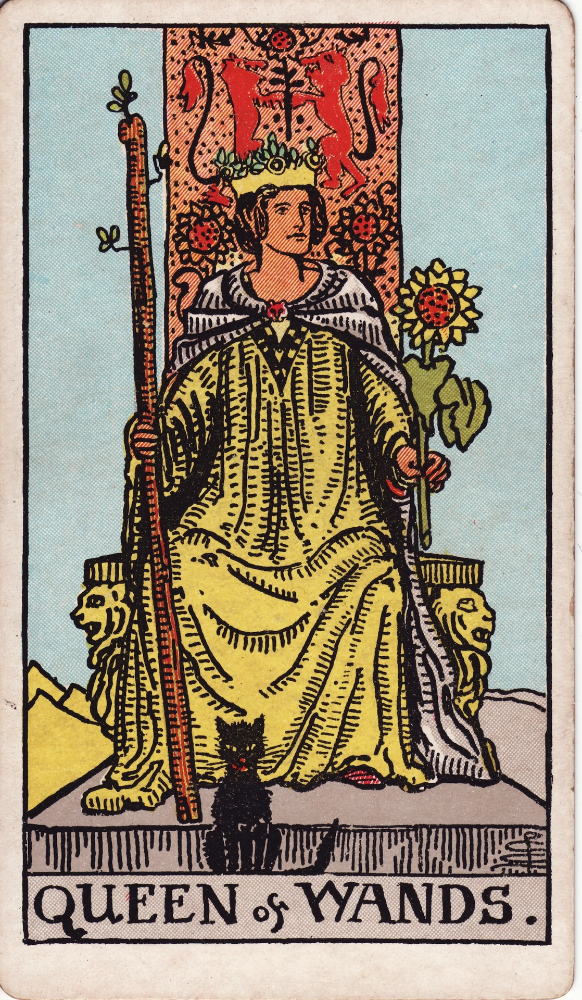

# Queen of Wands

The Queen of Wands is sovereign charisma—a magnetic leader whose warmth, confidence, and fierce compassion ignite everyone around her. She sits on a throne of sunlight, wielding creative power with grace, hospitality, and unwavering self-belief.

*Keywords:* charisma, magnetism, confidence, creative leadership, radiant presence
*Mood:* regal, warm, inviting, commanding
*Polarity:* receptive, magnetic

*Art interpretation cue:* Portray the Queen seated on a throne adorned with lions and sunflowers, holding a blossoming wand. A black cat or familiar rests nearby, signaling intuitive prowess and mystique.

### Artistic Direction

Convey commanding warmth—she is both torch and hearth. The composition should feel vibrant, welcoming, and subtly mysterious.

*   **Core Symbolism & Composition:**
    *   **Sunflowers & Lions:** Symbols of solar vitality, courage, and charisma.
    *   **The Black Cat:** Emphasizes intuition, witchy wisdom, and the Queen’s comfort with shadow.
    *   **The Throne:** Decorated with fire motifs, yet cushioned—power expressed with grace.
    *   **Radiant Palette:** Golden light, saffron robes, and warm earth tones embody her solar essence.
*   **Mood & Atmosphere:**
    Use glowing golds, ripe oranges, and lush greens. Allow light to emanate from the Queen herself, casting a welcoming aura.

### Esoteric Correspondences

*   **Title:** The Queen of the Thrones of Fire.
*   **Astrology:** Water of Fire—feeling-infused charisma, ruling 20° Pisces to 20° Aries.
*   **Element:** Water of Fire. Passion tempered by intuition, creativity made hospitable.
*   **Kabbalah:** Binah to Geburah in Atziluth. She shapes raw fire into purposeful, compassionate force.

### Archetypal Role

Queens (or Thrones) represent sovereignty, influence, and mature receptivity. In Wands, the Queen embodies magnetic leadership, creative mastery, and the ability to inspire community through presence.

### Core Meanings (Upright)

*   **Magnetic Confidence:** Commanding attention through authenticity and warmth.
*   **Creative Sovereignty:** Running your domain with flair and fierce devotion.
*   **Supportive Leadership:** Empowering others, hosting communities, fostering courage.
*   **Self-Assured Expression:** Owning your style, sexuality, and creative voice unapologetically.

### Core Meanings (Reversed)

*   **Diminished Confidence:** Hiding your light, shrinking to appease others, self-doubt.
*   **Jealousy or Manipulation:** Using charisma to control rather than uplift.
*   **Burnout from Overgiving:** Hosting everyone but yourself; energy depleted.
*   **Image over Integrity:** Valuing appearance or validation above authentic fire.

### The Card as a Person

*   **Upright:** A charismatic leader, performer, entrepreneur, coven mother, or beloved host whose presence emboldens others.
*   **Reversed:** Someone who feels threatened, retreats from visibility, or leverages charm for hidden agendas.

### Guiding Questions

*   **Upright:**
    *   Where am I being called to take up more space with confidence?
    *   How can I inspire others by modeling creativity and courage?
    *   What rituals help me stay grounded while shining brightly?
    *   Which arenas need my warmth, leadership, or calibration?
*   **Reversed:**
    *   What dimmed my spark, and how can I reclaim it?
    *   Where might envy or insecurity be asking for healing?
    *   How can I balance hospitality with self-care?
    *   What boundaries ensure I shine from a place of integrity?

### Affirmations

*   **Upright:** “My presence is a beacon; I lead with warmth, confidence, and creative fire.”
*   **Reversed:** “I tend my inner flame so my charisma shines with authenticity.”

### Love & Relationships

*   **Upright:** Passionate partnership, mutual admiration, vibrant social life, healthy flirtation.
*   **Reversed:** Possessiveness, intimidation, or feeling overshadowed or underappreciated.
*   **Self-Question:** “How can I nurture a love life that celebrates both my fire and my partner’s?”

### Work & Money

*   **Upright:** Successful leadership roles, public speaking, thriving businesses, personal branding excellence.
*   **Reversed:** Doubt undermining authority, fear of visibility, or misuse of influence.
*   **Self-Question:** “Where does my unique voice or style elevate the work we do?”

### Spiritual & Psychological

*   **Themes:** Empowered visibility, sacred sensuality, leading with heart and heat.
*   **Actionable Advice:**
    1.  **Solar Throne Ritual:** Sit on a chair like a throne; envision crown-light filling your body as you affirm your sovereignty.
    2.  **Pleasure Practice:** Engage in a ritual that celebrates your body and creativity—dance, adornment, or sensual meditation.
    3.  **Circle of Warmth:** Host a gathering (physical or virtual) to inspire, encourage, or celebrate others.

### Cross-Card Echoes

*   **Queen of Wands ↔ Queen of Cups:** Fire’s charisma meets water’s empathy—together, they craft compassionate leadership.
*   **Queen of Wands → King of Wands:** Personal magnetism evolves into visionary oversight.
*   **Queen of Wands ↔ Strength:** Both cards express courageous heart energy and graceful power.

### Impression Palette

#### Praise Poem

“She walks in sunflowers, laughter catching like flame; every room she enters remembers how to glow.”

#### Dramatic Aside

Watch how the cat curls round her throne—  
even shadow adores her light.
